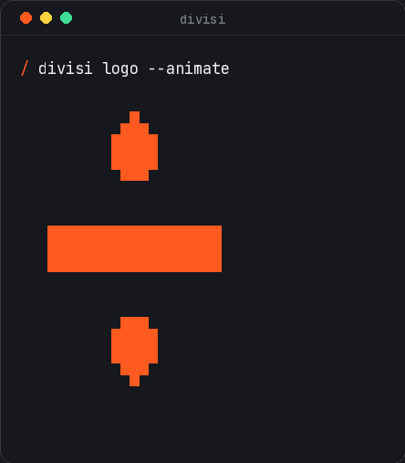
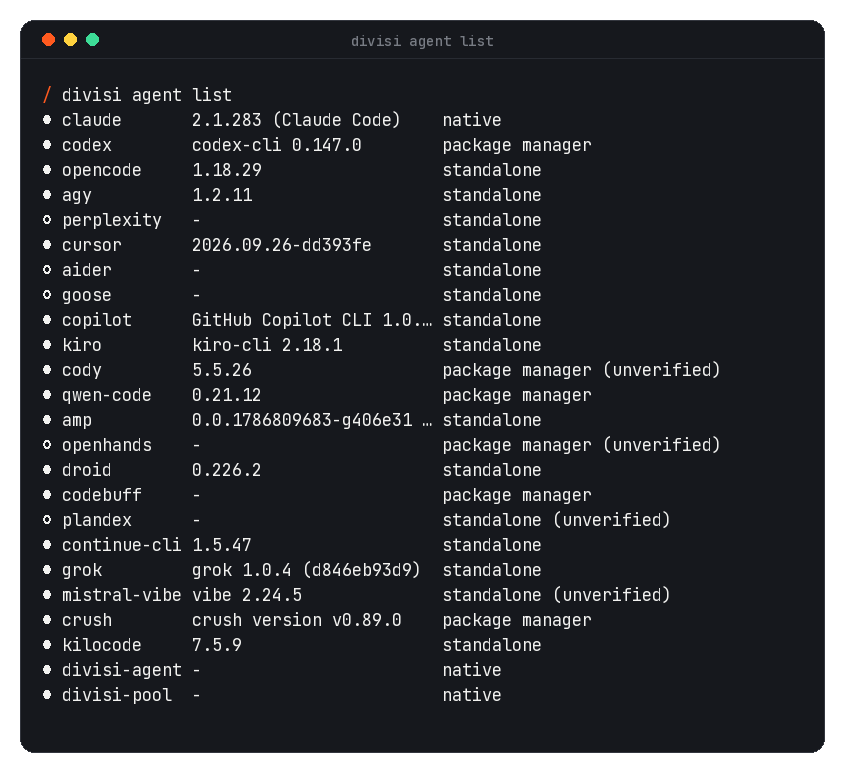
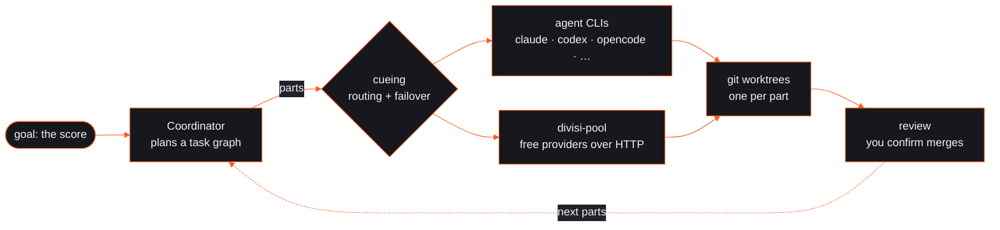

<div align="center">



<p>
  <a href="LICENSE"></a>
  <a href="https://github.com/naviNBRuas/TheDivision/releases"></a>
  <a href="https://github.com/naviNBRuas/TheDivision/actions/workflows/nightly.yml"></a>
  
  
  
  <a href="https://agentclientprotocol.com"></a>
</p>

<p>
  <a href="#install"><b>Install</b></a> ·
  <a href="#quickstart"><b>Quickstart</b></a> ·
  <a href="#how-it-works"><b>How it works</b></a> ·
  <a href="#whats-in-the-box"><b>What's in the box</b></a> ·
  <a href="docs/architecture.md"><b>Architecture</b></a> ·
  <a href="docs/FAQ.md"><b>FAQ</b></a>
</p>

</div>

**divisi** is the orchestration layer for AI coding agents. You state a goal. It splits the work into parts,
cues each part to whichever agent or model fits, and keeps the score.

It drives the agent CLIs you already use (Claude Code, Codex, OpenCode, Cursor, Copilot, Grok, Crush, Kilo Code
and 16 more) and keeps them in time. It gives them one registry for MCP servers, LSPs, provider keys and
accounts, synced into each tool's native format. When every CLI you're logged into is rate-limited, a built-in
pool of free LLM providers takes the next part over plain HTTP, so work doesn't stop.

> Six agents, one goal. Nobody plays over anybody.

<table>
  <tr>
    <td width="42%" align="center"></td>
    <td width="58%" align="center"></td>
  </tr>
  <tr>
    <td align="center"><sub>The mark: <code>÷</code> at rest, a spinning <code>/</code> while a part runs.</sub></td>
    <td align="center"><sub><code>divisi agent list</code>: what's installed, found live on your <code>PATH</code>.</sub></td>
  </tr>
</table>

## Why

Every agent CLI keeps its own config for the same things: MCP servers, provider keys, logins. Each uses its
own file and format. Each also has its own rate limits, and none of them know the others exist.

divisi keeps **one registry** for each of those and syncs it out to whatever is installed. It installs missing
CLIs on a fresh machine, and adds a brand-new agent CLI from **one TOML file**, with no recompiling. It never
touches your ambient `~/.claude` or `~/.codex` after first run: each agent gets an isolated divisi-managed
home under `~/.config/divisi/homes/<agent>/`, so two Claude accounts can run side by side.

On top of that sits the **Coordinator**. Hand it "add tests for the parser and fix whatever they find" and it
plans a real dependency graph, runs independent parts in parallel in their own git worktrees, and reroutes
around cooldowns. It queues a merge for you when it isn't sure. Branches are never merged on their own.

## How it works



| Term | What it is |
|---|---|
| **the score** | the goal you submit |
| **parts** | the task nodes it is split into |
| **the section** | your agents and models |
| **cueing** | routing and failover between them |
| **the bench** | the free-provider pool |
| **the pit** | `divisid`, the daemon |

## Install

**From a release.** The installer puts `divisi`, `divisid`, `divisi-mcp`, `divisi-gateway`, `divisi-agent`,
`divisi-lsp` and `divisi-notch` in `~/.local/bin` (override with `DIVISI_INSTALL_DIR`). It's a plain shell
script: [read it](install.sh) before piping it into `sh`.

```bash
curl -fsSL https://raw.githubusercontent.com/naviNBRuas/TheDivision/main/install.sh | sh
```

Releases published before the rename ship as `singlecli-*` archives; the installer takes either. Every
release builds Linux (x86_64, arm64) and macOS on Apple Silicon; macOS Intel is built best-effort.

**From source**, anywhere with a Rust toolchain:

```bash
git clone https://github.com/naviNBRuas/TheDivision && cd TheDivision
cargo build --release --workspace     # binaries land in target/release/
```

Stay current with `divisi update --yes`, or follow `main` with `divisi update --channel nightly --yes`.

## Quickstart

```bash
divisi doctor                 # what's installed, what divisi can manage
divisi agent list             # the section, detected live
divisi agent login claude     # log in inside claude's isolated home (real OAuth, real terminal)
divisi setup --yes            # install missing agent CLIs and sync config into all of them
divisi                        # the TUI: Agents, Goals, Tasks, MCP, LSP, Providers, Accounts, Pool, ...
```

Hand it a goal:

```bash
divisi goal submit "add tests for the parser and fix whatever they find" --mode auto
divisi coordinator status     # running, queued, blocked and waiting-on-capacity goals
divisi goal status <goal-id>  # the task graph, part by part
divisi goal merge list        # merges waiting for your yes
```

<details>
<summary><b>More: tasks, orchestration, accounts, providers, registries</b></summary>

```bash
# one prompt, one agent, any project directory
divisi task run "add a .gitignore" --agent claude --cwd ~/code/some-project

# several agents: a sequential relay, concurrent sub-tasks, or an explicit graph
divisi orchestrate "add tests for the parser" --agents claude,codex --worktree
divisi orchestrate-parallel --task claude:"backend API" --task codex:"frontend UI"
divisi orchestrate-graph --task 'id=build,agent=codex,desc="build it"' --task 'id=test,agent=claude,desc="test it",depends_on=build'

# multiple accounts of the same agent, running at the same time
divisi account capture claude work --label work@example.com
divisi task run "..." --agent claude --account work

# the free-provider pool: no CLI, no login
divisi provider list-free             # the vendored ~44-provider catalog
divisi provider add-free groq         # register a key and validate it
divisi provider key-status            # keyed, valid, cooldown and headroom per provider
divisi task run --agent divisi-pool "explain this diff"

# paid providers, synced into the agents that take them
divisi provider add-preset nvidia && divisi provider set-key nvidia nvapi-...
divisi provider sync nvidia --agents claude --yes

# one MCP/LSP/plugin registry for every agent
divisi mcp add-preset brave-search
divisi lsp add-preset clangd
divisi install-integrations --yes     # writes each agent's native config, with backups
divisi plugin add my-plugin my-plugin@official && divisi plugin sync my-plugin --agents claude --yes

# shared memory and notes between agents
divisi memory graph create-entity divisi project
divisi note leave --from me "parser tests are flaky on CI"   # no --to: any agent on this project

# Zed: point the agent panel at divisi
divisi acp
```

Every list and inspect command takes `--json`.

</details>

## What's in the box

| | |
|---|---|
| **24 built-in agents** | claude, codex, opencode, agy (Antigravity), cursor, copilot, kiro, cody, qwen-code, amp, droid, codebuff, continue-cli, grok, mistral-vibe, crush, kilocode, aider, goose, openhands, plandex, perplexity, plus divisi's own `divisi-agent` and `divisi-pool`. Add more with a TOML file in `~/.config/divisi/agents/`. |
| **Coordinator** | goal → dependency graph of `code`/`test`/`research`/`review`/`docs`/`infra` parts; parallel dispatch in isolated worktrees; retries, rerouting and a supervisor; `auto`, `plan`, `careful` and `dry` modes. |
| **Free-provider pool** | ~44 vendored free-LLM providers; Thompson-sampling routing; real per-key cooldown and headroom tracking; rate-limited or failing keys are benched automatically. |
| **One config, every agent** | MCP, LSP, tool, provider, plugin and skill registries synced into each agent's native format, with backups. |
| **Accounts** | capture and switch logins; run several accounts of one agent concurrently in isolated homes. |
| **Memory** | a shared SQLite knowledge graph, with optional Redis working memory and Qdrant vector search; task failures are recorded as searchable lessons. |
| **Surfaces** | CLI, a full TUI, a native Zed ACP bridge, and a GNOME Shell notch that shows the mark while work runs. |
| **Safety** | per-agent isolated homes, deny/ask/allow permissions enforced by `divisi-mcp`, secrets in the OS keychain, encrypted `divisi backup` archives, and merges that always wait for you. |

### Not yet

A real text-to-vector embedding pipeline (Qdrant stores and searches vectors you already have); LSP sync
into agents other than OpenCode; plugin discovery (installing a named plugin works, browsing doesn't); and
live per-provider model catalogs for the pool. The full, honest list is in
[`docs/architecture.md`](docs/architecture.md).

## Renamed from SingleCLI

divisi was SingleCLI until 0.24.0, and this repository was `naviNBRuas/SingleCLI` (old links redirect).

| Before | Now |
|---|---|
| `single`, `single-runtimed` | `divisi`, `divisid` |
| `singlecli-mcp`, `single-mcp` | `divisi-mcp`, `divisi-gateway` |
| `single-pool`, `single-<provider>`, `single/task-*` | `divisi-pool`, `divisi-<provider>`, `divisi/task-*` (old names still work) |
| `singlecli:<tool>` permission rules | `divisi:<tool>` (old rules still apply) |
| `SINGLE_*` environment variables | `DIVISI_*` (old names still read) |
| `~/.config/single` | `~/.config/divisi` (moved on first run, symlink left behind) |

The old command names were removed in 0.26.0. `divisi migrate` shows what an older install
needs (systemd unit, notch extension) and changes nothing without `--apply`.

## Development

```bash
cargo build --workspace
cargo test --workspace
```

No API keys are needed to build, test, or run `doctor` and `agent list`. `setup --yes`,
`install-integrations --yes`, `account use` and `provider sync --yes` touch real files; everything else is
read-only or runs in a temp directory under test. Redis and Qdrant are optional; their tests skip when no
service is reachable:

```bash
docker run -d -p 6379:6379 redis:7-alpine && docker run -d -p 6333:6333 qdrant/qdrant
DIVISI_REDIS_URL=redis://127.0.0.1:6379 DIVISI_QDRANT_URL=http://127.0.0.1:6333 cargo test --workspace
```

The README art is generated from the brand crate, so it moves exactly like the TUI and the notch:
`cargo run -q -p divisi-brand --example animated_mark -- 128 > .github/assets/mark-animated.svg`.

## Documentation

- [Architecture](docs/architecture.md): crates, data flow, and each phase's scope and limits.
- [Tech stack ADR](docs/adr/0001-tech-stack.md): why Rust, a Unix socket and SQLite.
- [Install methods](docs/install-methods.md): verified install commands for every agent CLI.
- [Config format](docs/config-format.md) · [FAQ](docs/FAQ.md) · [Contributing](CONTRIBUTING.md) · [Security](SECURITY.md) · [Support](SUPPORT.md)

## License

MIT. See [`LICENSE`](LICENSE).

<div align="center">
<br>

<br>
<sub>An independent project, endorsed by NBR Company. Built by Navin B. Ruas (<a href="https://github.com/naviNBRuas">naviNBRuas</a>).</sub>
</div>
